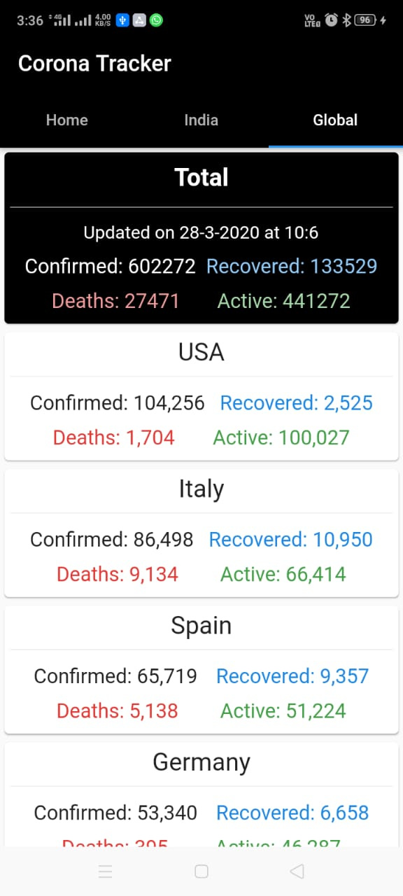
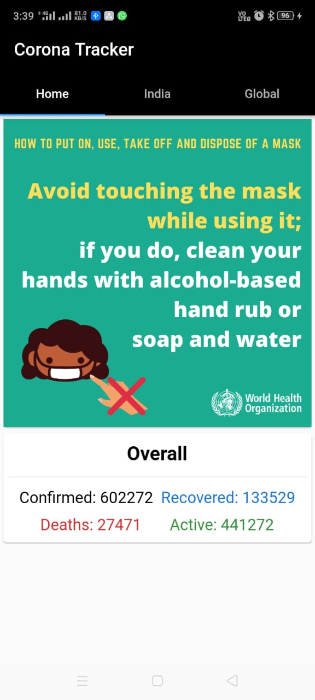
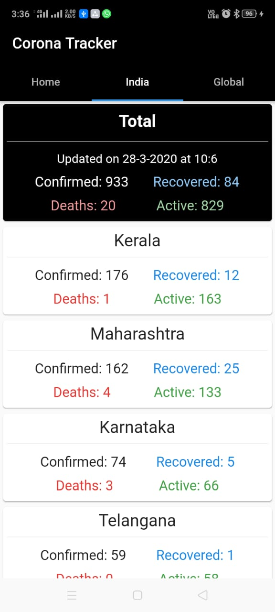

# corona

Coronavirus Tracker App in Flutter

Screenshots of output

<tabel>
  <row>
    <column>
        
    </column>
    <column>
        
    </column>
    <column>
        
    </column>
  </row>
</table>
